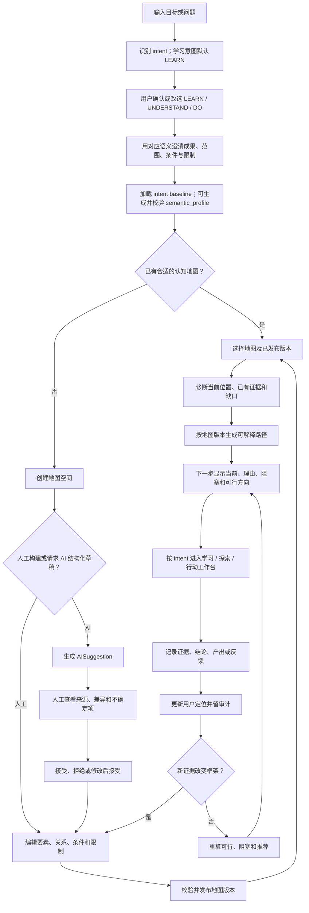
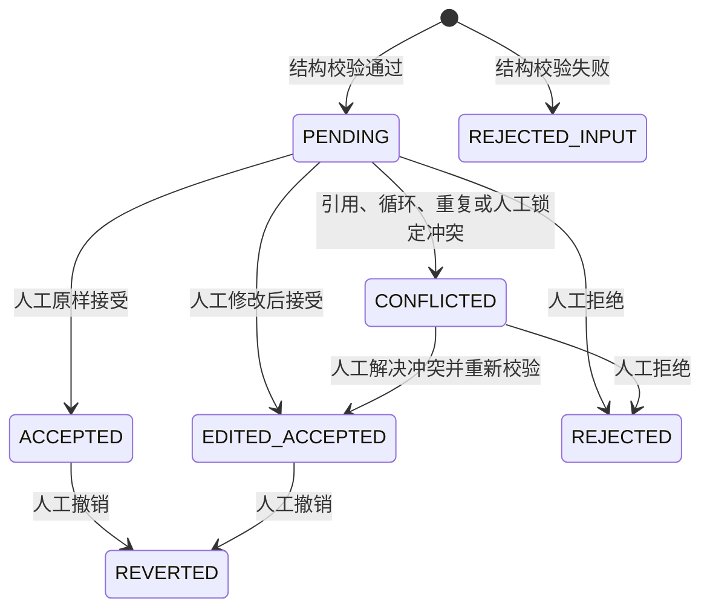

# Learning Navigator 通用框架构建与认知导航用户流程

本文描述用户如何从一个目标或问题建立框架、定位自己并进入可解释的下一步，以及地图、路径、个人状态和 AI 建议在流程中的边界。`LEARN` 是第一等、默认且当前主要流程，完整保留知识点、前置知识、掌握、能力维度、复习和学习记录；`UNDERSTAND`、`DO` 是共用底层闭环的并列扩展。仅现有数据库/API/Schema 的旧命名属于兼容范围，学习能力本身不是兼容层。页面布局见 [information-architecture.md](./information-architecture.md)，逐项验收见 [mvp-acceptance.md](./mvp-acceptance.md)。

## 1. 流程约定

### 1.1 三类数据不可混写

| 流程对象 | 创建/更新者 | 更新触发 | 不会发生的副作用 |
| --- | --- | --- | --- |
| 共享框架（`KnowledgeMap`） | 地图编辑者；AI 只能提交 `AISuggestion` | 人工编辑，或人工审核接受 AI 建议后生成地图草稿/版本 | 不修改任何用户的定位/进展；不自动替换现有路径 |
| 目标路径（`LearningPath`） | 路径服务按目标生成，用户可显式调整 | 创建目标、用户要求重算、确认迁移地图版本 | 不改变认知地图；不把路径顺序写成新的硬依赖；不删除个人历史 |
| 用户定位（`LearnerState`） | 用户、人工审核证据、透明规则服务 | 记录学习/探索/行动、证据或人工覆盖 | 不修改节点内容/关系；不自动发布地图；不因路径变化而丢失 |

AI 调用与上述三类对象隔开：AI 输出只进入建议队列；“审核接受”是独立的人工作业，接受后也先进入地图草稿而不是直接覆盖已发布版本。

### 1.2 关系和状态约定

- 硬依赖方向统一为“依赖项 → 被依赖项”；`LEARN` 中的正式学习关系类型是 `PREREQUISITE`，表示“前置知识 → 被依赖知识”。
- `CONTAINS` 只表达目录/包含，不用于解锁计算。
- 只有硬依赖参与可达性/先后/解锁计算并必须保持 DAG；其他关系组成可循环的语义网络，不得因 DAG 约束被删除或伪装成层级。
- `AVAILABLE` 必须同时满足：属于当前目标子图、所有硬前置达到最低等级、节点未归档、当前用户尚未达到目标等级。
- `BLOCKED` 必须返回直接阻塞项、当前状态、所需等级和推荐先学节点。
- 所有危险或不可逆动作均需明确确认；默认归档/版本化，不做静默硬删除。

### 1.3 `GoalIntent` 与 `semantic_profile` 流程约定

1. 系统先确定并保存稳定的 `GoalIntent` baseline；学习意图默认 `LEARN`，用户可以确认或改选。
2. 目标内容明确后，AI 可以生成目标级 `semantic_profile`，但必须先选择当前 intent 的版本化 `template_id`：`LEARN_MASTERY_V1` / `LEARN_PRACTICE_V1`、`UNDERSTAND_FAMILIARITY_V1` / `UNDERSTAND_EVIDENCE_V1` 或 `DO_DELIVERY_V1` / `DO_READINESS_V1`。`status_labels`、`action_labels`、`dimension_labels` 必须是 Strict JSON Schema 中的显式固定字段对象：状态对象恰含六个 canonical key，动作对象只含 `AVAILABLE` / `IN_PROGRESS` / `NEEDS_REVIEW`，维度对象恰含 `concept_understanding` / `procedural_skill` / `application_skill` / `memory_strength`；不能用开放字典或额外 key。五类对象称谓与四维显示名可自由适配内容。
3. 系统先对每个词执行 NFKC、首尾去空白、内部空白折叠，再以 `casefold` 结果校验；`Cc` / `Cf` 字符拒绝，同组状态词和动作词必须唯一。`template_id` 必须属于当前 intent，整组 `status_labels` 与整组 `action_labels` 必须逐槽精确匹配该模板。状态、动作不是自由文案：`never mastered`、`not—mastered`、`绝非已掌握`、`never start`、`Not learned`、`Do not start`、`No review` 均拒绝。
4. 每个进度分段严格为 `{min_score, label}`，共 3–6 项，首项为 0、后续严格递增且落入对应 level count 的安全阈值带：三级 `0 / 30–55 / 70–100`，四级 `0 / 15–40 / 45–70 / 75–100`，五级 `0 / 10–30 / 35–55 / 55–80 / 80–100`，六级 `0 / 8–25 / 20–45 / 35–65 / 55–85 / 80–100`。这些只是额外结构防线；完整有序的进度元组仍必须逐项精确匹配同一 `template_id`，不得交换中间等级、自行改写、跨模板拼接或跨 intent 复用。
5. Profile 是可选展示元数据。AI 生成、读取已保存旧 draft 或激活 draft 时，任一字段、模板 ID、模板整组匹配、归一化或结构校验失败都将整个 `semantic_profile` 置空并回退当前 `GoalIntent` baseline；不得保留部分 AI 词，也不得使有效核心地图/路线草稿的生成、读取或激活失败。只有 intent 缺失时才回退默认 `LEARN` baseline。
6. UI 按 `template_id` 与 canonical 槽位渲染显示词，交互事件直接携带固定 canonical command/status；不得通过自然语言把显示词反向解析成命令或状态。`progress_levels.min_score` 只决定显示词分段；AI 文案永远不能成为新的命令、状态、canonical 状态/四维阈值、证据类型、解锁条件或路线参数。

因为 `semantic_profile` 不修改地图、用户状态或计算结果，通过确定性校验的 Profile 可以自动用于呈现，不等同于接受地图内容建议；任何 AI 生成的节点、关系、路线事实或证据仍必须进入原有 `AISuggestion` 审核流程。

## 2. 主流程：目标/问题 → 框架 → 定位 → 路径 → 证据 → 更新



### 2.1 正常步骤

1. 用户从“+ 新目标”输入目标或问题。系统识别 intent：明显的学习目标默认进入 `LEARN`，并允许用户确认或改选 `UNDERSTAND` / `DO`；不得每次都强迫用户从中性模板开始。
2. 系统先使用 `GoalIntent` baseline 澄清结果：`LEARN` 询问目标知识/技能、目标掌握和能力维度，`UNDERSTAND` 询问认知范围与判断标准，`DO` 询问成果与验收；AI 不得替用户暗中改写目标。
3. AI 可按目标内容生成 `semantic_profile`。例如行业 `UNDERSTAND` 可选择完整 `UNDERSTAND_FAMILIARITY_V1`，从而显示其受控进度 `[0] 不知道 → [25] 听说过 → [55] 了解 → [85] 非常了解`；这些 `min_score` 只选择显示词，不影响 canonical 四维分数、状态阈值、证据、解锁或路线。
4. 用户选择已有地图版本，或创建新的地图空间。
5. 新空间可以完全手工构建，也可以在明示同意后向已配置 AI Provider 请求符合模板 Schema 的结构化草稿。
6. 用户审核基本要素、关系、条件、限制、来源和不确定项；只有硬依赖必须通过 DAG 校验。
7. 系统读取该用户的状态对象。`LEARN` 直接读取掌握等级、能力维度、复习和学习证据；其他 intent 读取理解/验证或行动/验收状态，但都不把个人状态写入地图。
8. 系统诊断当前位置和缺口，结合硬依赖、其他关系、条件、限制及用户偏好，创建带地图版本/算法版本的可解释路径。
9. “下一步”把第一项转成可行动导航；用户可以展开路径、阻塞链和证据核对依据。
10. 用户进入由 intent 决定的学习、探索或行动工作台并记录相应证据。`LEARN` 明确记录学习活动、练习、能力表现、复习和掌握变化；提交后系统保留证据与审计，重算节点分类和推荐。
11. 新证据若改变对整体结构的认识，进入地图草稿审核而非直接改写正式地图；否则只更新用户定位和路径。

### 2.2 分支和退出

- 没有可用地图：进入“创建地图”，不伪造推荐或直接答案。
- 地图仍是草稿：可编辑和预览，但只有人工发布后才成为新目标的默认来源。
- 目标节点已掌握：说明依据，并允许提高目标等级、选择别的目标或直接完成。
- 路线中没有 `AVAILABLE`：展示是地图错误、缺失节点、归档节点还是未达前置，不显示空白列表。
- 用户中途退出：保存显式草稿，不把未提交表单当作证据或状态更新。

### 2.3 模板分支

- `LEARN`（默认、第一等）：路径节点进入学习工作台，进展由掌握等级、能力维度、复习状态、学习记录与学习证据表达；硬依赖主要是前置知识关系。
- `UNDERSTAND`：路径节点进入探索工作台，用户收集来源、事实、反例和判断，定位已理解、待验证与未知区域；推荐可以是查证、比较或深入一个机制，不伪装成线性课程。
- `DO`：路径节点进入行动工作台，用户记录产出、验收、决策和外部条件变化，定位可执行、阻塞和风险；推荐可以是行动或决策，但不扩张为通用任务排程。

## 3. 首次使用与知识空间选择

### 3.1 首次使用

1. 系统展示产品边界：这是框架构建与认知导航工具，不是课程生成器、直接答案工具、纯脑图或通用任务管理器；AI 可选且建议需人工审核。
2. 用户选择“+ 新目标”“使用示例地图”“导入 JSON”或“创建空白地图”。
3. 创建目标时系统先识别 intent；学习目标默认 `LEARN`，用户可以确认或改选。选择示例时，系统复制可编辑实例，不把示例用户状态预填给用户。
4. 用户澄清目标/问题后进入主流程。

### 3.2 选择已有地图

1. 用户按标题、范围或更新时间搜索知识空间。
2. 卡片展示已发布版本、节点数、关系数、是否有更新草稿和来源摘要。
3. 用户打开浏览页确认目标节点和关系。
4. 创建目标时系统锁定使用的地图版本，并在路线页持续显示。

### 3.3 导入地图

1. 用户选择 JSON 文件并看到将读取的本地范围。
2. 系统在临时区校验格式版本、稳定键、关系引用、重复边和 `PREREQUISITE` DAG。
3. 系统展示创建、合并、冲突和忽略项预览。
4. 用户选择默认安全方式“创建为新空间/新草稿”。
5. 用户确认后才落库；任何 BLOCKER 校验失败时整批不写正式数据。

## 4. 人工构建知识地图

1. 编辑者创建知识空间，填写标题、描述、目标人群、包含范围和排除范围。
2. 创建模块或知识节点；每个节点有稳定键、类型、难度、学习目标和来源。
3. 通过关系表单选择明确关系类型：
   - `CONTAINS`：模块包含节点；
   - `PREREQUISITE`：前置节点指向被依赖节点；
   - 其他关系只用于语义浏览，不参与硬解锁。
4. 保存 `PREREQUISITE` 前，系统检查节点存在、空间一致、重复边和循环。
5. 若检测到循环，系统显示完整闭环（例如 `A → B → C → A`），拒绝该边，保留表单供修正。
6. 编辑者在大纲和图谱预览之间切换，确认跨模块依赖和孤立节点警告。
7. 编辑者提交草稿审核；系统显示相对上一版本的节点和边差异。
8. 人工确认后发布不可变版本。新目标可选择它，旧路线仍引用旧版本。

异常分支：

- 归档被路线引用的节点：系统列出受影响路线，要求创建新版本；不会直接删除路线或个人状态。
- 编辑基线已过期：系统阻止覆盖并提供“基于最新版重放”“复制为新草稿”“放弃”。
- 存在孤立节点：可以保存草稿并警告；是否允许发布按严重性规则决定，不自动伪造关系。

## 5. AI 生成与人工审核



### 5.1 生成草稿

1. 用户选择自然语言目标、粘贴大纲、Markdown、纯文本或 JSON 节点输入。
2. 若 AI 关闭或未配置，页面保留输入并提供“转为人工创建”；不发请求。
3. 若启用外部 Provider，用户预览即将发送的内容，主动确认；未选择的笔记、证据和附件不随请求发送。
4. AI 返回结构化结果；系统对未知字段、临时 ID、关系引用、枚举、置信度和 DAG 严格校验。
5. 校验通过的结果保存为 `AISuggestion`，仍不写正式节点/边；失败结果显示字段路径，不创建可接受项。

### 5.2 审核建议

1. 审核者查看生成模型、提示词版本、输入来源、时间、原始结构化输出、警告和不确定项。
2. 每项显示当前值、建议值、理由、来源和置信度；结构关系同时显示受影响上下游。
3. 审核者逐项选择：接受、拒绝、修改后接受。
4. “批量接受”只在用户勾选并预览低风险项后可用；节点增删、前置边、合并、删除及覆盖人工字段不得被标为低风险。
5. 接受前再次运行引用、重复边和 DAG 校验。通过后写入新的地图草稿并记录人工审核动作；仍需人工发布地图版本。
6. 用户可撤销一次审核结果或回滚对应地图版本；系统保留 AI 原建议、人工最终值和撤销人。

### 5.3 禁止路径

- AI 响应 → 直接写 `KnowledgeNode`/`KnowledgeEdge`：禁止。
- 高置信度 → 自动接受：禁止。
- AI 评价学习表现 → 自动提升 `mastery_level`：禁止。
- AI 合并节点 → 自动迁移个人状态：禁止。
- 关闭 AI 后仍后台发送输入或探测 Provider：禁止。

## 6. 创建目标、诊断与生成路线

1. 用户从节点详情或目标与路线页选择目标节点。
2. 用户设置目标掌握等级和路线偏好；截止日期、每日/每周负荷为可选。
3. 系统确认目标节点属于所选已发布地图版本且未归档。
4. 系统生成目标的 `PREREQUISITE` 祖先子图。`CONTAINS` 仅用于展示位置，不加入前置计算。
5. 系统读取当前用户的 `LearnerState`：达到目标所需等级的节点被排除；没有状态的节点按未接触处理，但不改写数据库。
6. 系统按硬前置拓扑顺序，再结合难度、掌握程度、必要性和用户偏好生成路线。
7. 每个路线节点保存推荐理由、已满足/未满足前置、完成后解锁和算法版本。
8. 用户预览后确认创建 `LearningPath`。路线引用地图版本，但不会修改该版本。

路线偏好约束：

- “最短可行”只能减少可选内容，不能跳过硬前置。
- “项目优先”可提高项目/应用节点排序，但必须等待硬前置满足。
- “人工自定义”可调整同一拓扑层内顺序或添加明确标注的补充节点；非法次序必须提示而不能保存成可执行路线。

## 7. 首页 / 下一步流程

首页保持五个信息位置，但问题和动作由 intent 决定，不能统一显示为“推进”：

1. `LEARN` 默认问“我当前在学什么、掌握到哪里”；`UNDERSTAND` 问“我正在理解什么”；`DO` 问“我要做成什么”。
2. `LEARN` 问“为什么要学这个知识点”；其他 intent 分别解释探索/查证或执行/决策理由。
3. `LEARN` 明确给出“下一步学什么、是否需要复习”；其他 intent 给出下一步探索/验证或行动/产出。
4. `LEARN` 展示缺失的前置知识和薄弱能力维度；其他 intent 展示缺失证据/视角或依赖/条件。
5. `LEARN` 展示学会后解锁的知识和能力；其他 intent 展示判断变化或成果解锁与验收。

操作流程：用户选择 intent 对应的“开始/继续学习”“开始探索/查证”或“开始执行/验收”进入对应工作台；选择阻塞项进入节点详情；选择路径概览进入目标与路径页。学习时长、打卡、任务数量和排名不能抢占上述信息。

空状态：

- 无目标：主行动是“+ 新目标”。
- 目标无地图：主行动是“选择或创建认知地图”。
- 目标完成：展示依据并提供“归档目标/提高目标等级/选择新目标”。
- 路线失效：保持旧路线可见，列出地图变化，要求明确重算。

## 8. 学习工作台与状态更新

1. 用户从首页或路线打开一个 `AVAILABLE` / `IN_PROGRESS` 节点。
2. 工作台展示学习目标、为什么学、前置已满足情况、资源、笔记和现有证据。
3. 用户可开始/结束学习记录；计时只是可选元数据，不作为首页核心指标。
4. 用户按需填写资源、笔记、困难点、自评、证据和下一步计划，允许仅提交其中一项。
5. 系统先保存 `LearningSession`/`LearningEvidence`，再按透明规则计算建议的分数或状态变化。
6. 若展示等级将提高，页面说明依据；需要人工确认的提升必须经用户确认。AI 评价仅作为候选证据。
7. 用户提交后生成审计记录并更新自己的 `LearnerState`。
8. 路线服务重算可学习、阻塞和推荐，不改变知识地图。
9. 页面显示“此次变化解锁了什么”，并返回新的首页导航。

人工覆盖流程：用户选择“手动调整状态” → 查看当前值和证据 → 输入新值及可选理由 → 二次确认 → 保存前后值、操作者和时间 → 重算路线。覆盖不删除原证据。

## 9. 阻塞解释流程

1. 用户打开一个 `BLOCKED` 节点。
2. 系统列出未达最低等级的直接前置，并递归追踪到首个可行动节点。
3. 每项显示前置节点状态、当前/所需掌握等级、是否归档，以及为什么阻塞。
4. 若有多个可行先修，系统按当前路线偏好排序并明确“这是排序建议，不是新的硬依赖”。
5. 用户选择“先学习推荐节点”，系统只改变当前导航焦点，不重写地图关系。

示例：

```text
反向传播（BLOCKED）
└─ 链式法则：当前 0，需要 3
   └─ 基本求导：当前 0，需要 3，AVAILABLE
推荐下一步：基本求导
```

若无法找到可行动节点，系统区分“地图含环/缺失引用”“所有入口已归档”“规则配置矛盾”等数据问题，并引导地图编辑者修复。

## 10. 地图版本更新与路线迁移

1. 地图编辑者发布新版本。
2. 系统比较当前路线所引用版本与新版本，标记受影响路线为 `STALE`，但不自动替换。
3. 用户查看影响：新增/归档节点、前置变更、稳定键映射、个人状态可复用项和无法映射项。
4. 用户选择“继续旧路线”或“生成候选新路线”。
5. 候选路线与旧路线并列比较；只有确认后才成为 `CURRENT`，旧路线变为 `SUPERSEDED`。
6. `LearnerState` 继续绑定稳定节点；涉及合并/替换时逐项确认映射并留审计，未确认项保持原历史且标记待处理。

## 11. 无 AI 模式

1. 设置页显示 AI 为“未配置”或“已关闭”，以及最后一次更改者和时间。
2. AI 建议入口保持可见但禁用请求，说明可用的人工替代步骤。
3. 用户仍可人工建图、编辑六类关系、发布地图、创建目标、计算路线、记录状态、导入和导出 JSON。
4. 任何页面不得因缺少 Provider 密钥而无法启动或出现假建议。

## 12. 数据导出、恢复与删除

### 12.1 导出

1. 用户选择完整备份或按空间/个人数据自定义范围。
2. 页面说明是否包含 AI 原始输出、审计详情和附件；密钥永不在范围中。
3. 系统估算对象数量和文件大小，用户确认后生成版本化 JSON/ZIP。
4. 完成后显示保存位置、对象计数和校验摘要；失败时不把半成品标为成功。

### 12.2 恢复/导入

1. 用户选择导出包。
2. 系统校验清单、模式版本、引用、重复边和 DAG。
3. 页面预览创建、冲突、需要升级和忽略项。
4. 默认导入为新空间/新草稿；覆盖或合并必须逐项确认。
5. 成功后生成导入审计；失败则正式数据保持不变。

### 12.3 删除

1. 普通“删除”执行归档/软删除，说明受影响路线和引用。
2. 设置页的永久清除必须展示范围、导出建议和不可恢复后果，并二次确认。
3. 清除完成后只保留不含正文的必要操作摘要；是否保留由隐私政策和用户选择决定。

## 13. 异常恢复总表

| 发生位置 | 失败状态 | 用户下一步 | 一致性保证 |
| --- | --- | --- | --- |
| AI 请求 | 超时、限流、认证失败 | 重试、换 Provider、复制输入或人工创建 | 无正式地图写入；输入草稿保留 |
| AI 校验 | 未知字段、缺 ID、无效引用、环 | 查看字段错误并编辑/重试 | 不产生可接受建议 |
| 语义 Profile | 固定字段缺失/额外，未知或 cross-intent `template_id`，状态/动作/进度任一槽位未精确匹配同一模板，组内重复，含 `Cc` / `Cf`，或进度结构无效 | 生成/旧 draft 读取/激活时丢弃整个 Profile，显示 `GoalIntent` baseline | 有效核心地图与路线继续处理；canonical 状态、四维分数、证据、解锁和路线零变化 |
| 地图编辑 | 循环、重复边、版本冲突 | 修正边或重新基于最新版 | 该变更原子失败，已发布版本不变 |
| 路线生成 | 目标不存在、图损坏、无可用节点 | 更换目标或进入修复入口 | 不创建虚假空路线 |
| 状态保存 | 并发值冲突、证据附件失败 | 比较、重试或只保存文本 | 不静默覆盖；部分成功必须清楚列出 |
| 导入 | 格式/引用/DAG 无效 | 下载错误报告并修复 | 正式数据零写入 |
| 导出 | 权限、磁盘、序列化失败 | 更换路径或重试 | 原数据不变；半成品不宣称成功 |

## 14. Given–When–Then 流程验收摘要

### UF-01 完整人工闭环

**Given** 用户未配置 AI，且有一个空数据库
**When** 用户人工创建“Python 基础”地图、发布版本、选择目标、生成路线、记录一个前置节点为已掌握
**Then** 系统生成新下一步；地图节点和关系未因个人状态更新而改变；路线和状态都有独立记录。

### UF-02 AI 人工审核门槛

**Given** AI 返回三个节点和两条关系建议
**When** 审核者拒绝一个节点、修改一条前置边并接受其余项
**Then** 正式地图草稿只包含人工最终接受内容；每项均能追溯原建议、审核人和差异；发布仍需人工确认。

### UF-03 环形边

**Given** 地图已有 `A → B`、`B → C`
**When** 用户尝试创建 `C → A`
**Then** 系统原子拒绝并显示 `A → B → C → A`；原两条边保持不变。

### UF-04 阻塞解释

**Given** “基本求导 → 链式法则 → 反向传播”，当前用户三个节点均未掌握
**When** 用户以“反向传播”为目标打开阻塞解释
**Then** 页面说明反向传播被链式法则阻塞、链式法则被基本求导阻塞，并推荐可学习的基本求导。

### UF-05 地图版本隔离

**Given** 当前路线引用地图 v1，编辑者发布 v2 并更改前置关系
**When** 用户再次打开路线
**Then** 旧路线仍可查看且被标记过期；系统展示影响，未获确认前不替换路线、不迁移个人状态。

### UF-06 安全导入

**Given** 导入包中存在指向未知节点的前置边
**When** 用户执行导入
**Then** 系统指出对象和字段、整批不写正式数据，并允许下载错误报告。

### UF-07 隐私发送确认

**Given** 用户的节点笔记含私密内容，AI Provider 已配置
**When** 用户只选择目标描述请求 AI 构图
**Then** 发送预览不包含未选择笔记；取消确认后不产生网络请求或建议记录。

### UF-08 可访问替代路径

**Given** 用户仅使用键盘和屏幕阅读器
**When** 用户查看图谱并创建一条前置关系
**Then** 用户可通过大纲/关系表完成同一任务，获得与画布相同的方向、状态和错误信息。

### UF-09 行业理解语义自适应

**Given** 用户创建“了解半导体行业”目标，确认 `GoalIntent = UNDERSTAND`，canonical 四维分数与路线已经生成
**When** AI Profile 选择 `UNDERSTAND_FAMILIARITY_V1`，完整提供该模板的状态、动作和 `[0] 不知道 → [25] 听说过 → [55] 了解 → [85] 非常了解`，并把对象称谓适配成“关键问题/认知模块/认知路径/探索记录/判断依据”
**Then** 页面使用这些目标级显示词；状态 key、四维值、证据、阻塞/解锁与路线顺序和 Profile 应用前完全一致。

### UF-10 Profile 整组安全回退

**Given** 一个已保存、核心地图有效的 `LEARN` draft，其 `semantic_profile` 有效设置知识点称谓，但遗漏 `NEEDS_REVIEW`、把 `MASTERED` 写成 `Not learned`，并含零宽 `Cf` 字符和两个进度等级
**When** 系统读取或激活该旧 draft
**Then** 丢弃整个 Profile（包括原本有效的知识点称谓）并使用 `LEARN` baseline；核心地图与激活继续成功，不会创建状态、改变算法或写入 canonical 数据。

### UF-11 受控模板绕过必须失败

**Given** 一个其他字段均合法的 Profile，测试方依次将受控状态改成 `never mastered`、`not—mastered` 或 `绝非已掌握`，将受控动作改成 `never start`，交换完整模板的中间进度等级，或在 `LEARN` 目标上提交 `DO_DELIVERY_V1` / 混入另一模板的状态、动作或进度
**When** 系统校验新请求，或读取/激活包含这些变体的旧 draft
**Then** 新请求在校验边界拒绝；旧 draft 的 `semantic_profile` 整组置空并回退 `LEARN` baseline，核心地图继续可用。NFKC、空白折叠或 `casefold` 不得把任何近似、否定、倒序、cross-intent 或混搭内容解释成合法模板。
